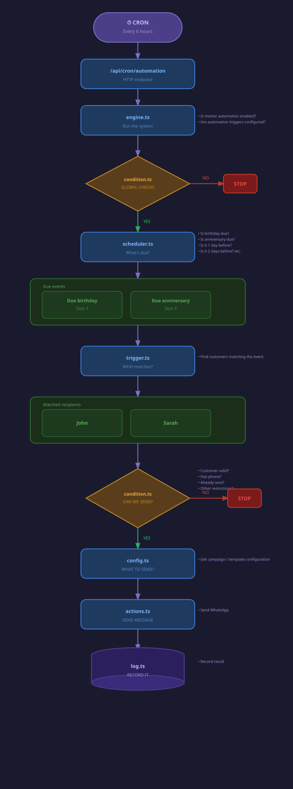

# Campaign Automation Engine

A production-grade automation engine that fires personalised WhatsApp, Email, and SMS campaigns at exactly the right moment — birthdays, anniversaries, and custom lifecycle events — with zero manual intervention.

> Built and battle-tested as the core messaging backbone of a live commercial product.

## System Architecture

[View the complete automation pipeline on Eraser](https://app.eraser.io/workspace/7mVFWepOu1NQOf6zMrwl?diagram=5KlJFs2M0id1Z3z3vjTE)

---
## Detailed Operational Flow

The engine operates as a deterministic pipeline. Every single request must pass through seven distinct stages of validation and processing to ensure maximum deliverability and zero redundancy.

### 1. Orchestration Layer (`engine.ts`)
The system is triggered by a CRON job (typically every 6 hours) which hits the `/api/cron/automation` endpoint. The `engine.ts` file acts as the master orchestrator, initializing the run and aggregating results for all enabled restaurants.

### 2. Global Validation (`condition.ts`)
Before processing any customers, the engine performs a "circuit breaker" check:
- **Master Switch**: Verifies if the automation is enabled at the restaurant level.
- **Configuration Check**: Ensures that triggers are properly configured.
If these fail, the process for that specific restaurant is terminated immediately to save resources.

### 3. Temporal Scheduling (`scheduler.ts`)
The scheduler determines the "Target Date." It doesn't look for customers yet; instead, it calculates the window based on the restaurant's settings:
- **T-0**: Today.
- **T-1**: 1 day before the event.
- **T-2**: 2 days before the event.

### 4. Customer Matching (`trigger.ts`)
Once the target date is established, the Trigger Matcher performs a database sweep. It identifies customers whose event dates (e.g., Birthdays or Anniversaries) match the calculated target window.

### 5. Individual Eligibility (`condition.ts`)
For every matched customer, a granular set of conditions is applied:
- **Identity Validation**: Ensures the customer has a valid ID and belongs to the correct restaurant.
- **Contact Verification**: Confirms the customer has the required contact method (e.g., a phone number for WhatsApp).
- **Anti-Spam Filter**: Queries the `automation_logs` to ensure the same trigger hasn't been sent to this customer within the last 24 hours.

### 6. Templating & Delivery (`config.ts` & `actions.ts`)
If eligible, the engine maps the `triggerType` to a local template in `config.ts`. This decouples the marketing content from the database, allowing for rapid template updates without DB migrations. The final payload is then dispatched via the `actions.ts` (or the internal WhatsApp API).

### 7. Persistence Layer (`log.ts`)
The final step is the "Success Write." Only after the sending API returns a success response is a log entry created. This ensures that if a send fails, the customer remains eligible for a retry in the next cron cycle.

## Technical Summary

| Stage | Component | Primary Responsibility | Critical Check |
| :--- | :--- | :--- | :--- |
| **Trigger** | CRON | Execution Timing | Frequency (e.g., 6h) |
| **Validate** | `condition.ts` | System Integrity | Master Enable Flag |
| **Schedule** | `scheduler.ts` | Window Calculation | Offset Days (0, 1, 2) |
| **Match** | `trigger.ts` | Recipient Identification | Event Date Match |
| **Filter** | `condition.ts` | Recipient Eligibility | Duplicate Send Check |
| **Dispatch** | `actions.ts` | Message Delivery | API Response Status |
| **Audit** | `log.ts` | State Persistence | Successful Delivery |

## Project Structure
- `/engine/engine.ts`: Master orchestrator.
- `/engine/scheduler.ts`: Timing and restaurant filtering.
- `/engine/trigger.ts`: Customer event matching.
- `/engine/condition.ts`: Global and individual validation.
- `/engine/config.ts`: Campaign template configuration.
- `/engine/log.ts`: Automation history and anti-spam.
